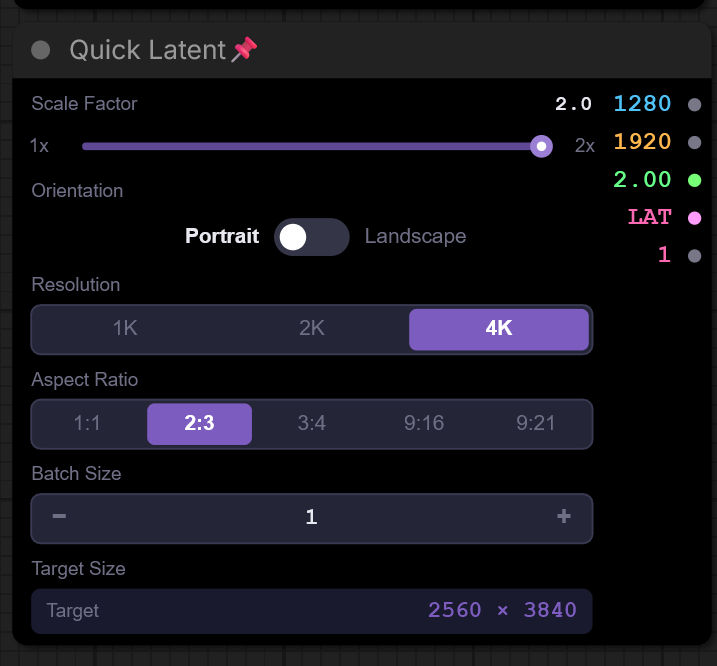
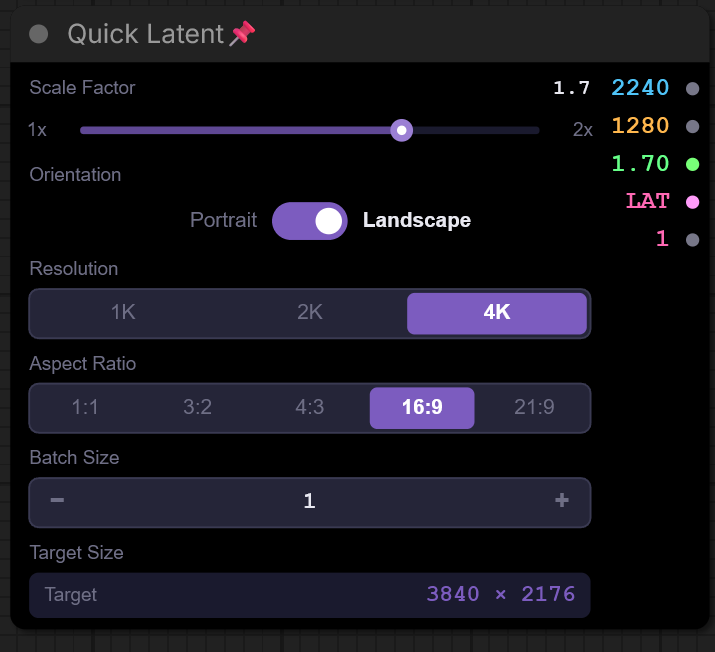

# ComfyUI Quick Latent

[English](README.md) | [繁體中文](README_zhTW.md)

A streamlined ComfyUI custom node for creating latent tensors from common resolution presets.

<table>
  <tr>
    <td></td>
    <td></td>
  </tr>
</table>

Quick Latent lets you choose a resolution tier, aspect ratio, orientation, scale factor, and batch size, then outputs the calculated width, height, scale, latent tensor, and batch size.

## Features

| Feature | Description |
| --- | --- |
| Resolution presets | Choose from 1K, 2K, and 4K target sizes. |
| Aspect ratios | Supports 1:1, 2:3, 3:4, 16:9, and 21:9. |
| Orientation | Switch between landscape and portrait layouts. |
| Scale factor | Generate latent dimensions from 1.0x to 2.0x downscale factors. |
| Batch size | Create latent batches from 1 to 64. |
| Custom UI | Uses a compact canvas UI inside the ComfyUI node. |
| Outputs | Returns width, height, scale, latent, and batch size. |

## Installation

### Via ComfyUI Manager

Search for `comfyui-quick-latent` in ComfyUI Manager and click Install.

Restart ComfyUI after installation.

### Manual Installation

Clone this repository into your ComfyUI custom nodes directory:

```bash
cd ComfyUI/custom_nodes
git clone https://github.com/Zhen-Bo/comfyui-quick-latent.git
```

Restart ComfyUI after installation.

## Usage

Add the `Quick Latent` node from the `QuickLatent` category.

Use the node controls to select:

- Resolution: `1K`, `2K`, or `4K`
- Aspect ratio
- Orientation
- Scale factor
- Batch size

The node returns a zero-filled latent tensor and the matching dimension values for downstream ComfyUI workflows.

## Outputs

| Output | Type | Description |
| --- | --- | --- |
| `OUTPUT_WIDTH` | `INT` | Computed latent image width. |
| `OUTPUT_HEIGHT` | `INT` | Computed latent image height. |
| `SCALE` | `FLOAT` | Selected scale factor. |
| `LATENT` | `LATENT` | Zero-filled latent tensor. |
| `BATCH_SIZE` | `INT` | Selected batch size. |

## Roadmap

- Add a `Custom` resolution mode
- Allow direct editing of output width and height labels
- Automatically switch to custom mode after manual dimension edits
- Disable aspect ratio selection while custom dimensions are active

## License

MIT License. See [LICENSE](LICENSE).
